# VatanPay - Blockchain Remittance Platform

<div align="center">

**Send money home instantly with 0.5% fees using MoneyGram + Stellar**

[](https://stellar.org)
[](https://moneygram.com)
[](https://circle.com)
[](https://react.dev)

[Live Demo](https://vatan-pay.vercel.app/) | [Documentation](./docs/HOW_IT_WORKS.md) | [Business Model](./docs/BUSINESS_MODEL.md)

</div>

---

## 🚀 Quick Start

```bash
# Clone repository
git clone https://github.com/Nihal-Pandey-2302/VatanPay
cd VatanPay

# Start development server (automatically installs dependencies)
./start.sh
```

**Or manually:**

```bash
cd frontend
npm install
npm run dev
```

Visit `http://localhost:5173` and connect your Freighter wallet!

---

## 💡 What is VatanPay?

VatanPay enables Indian migrant workers in the Gulf to send money home instantly with **10x lower fees** than traditional remittance services.

---

## 🚨 Problem Statement

### The $36 Billion Challenge

Every year, **9 million Indian migrant workers** in the Gulf send **$36 billion** home to support their families. But traditional remittance services extract **$2.5 billion in fees** from these hard-earned wages.

### Who Suffers?

**Meet Ahmed:** A 34-year-old construction worker in Dubai earning 4,500 AED/month. He sends 2,000 AED home monthly to support his wife and two children in Bihar, India.

**Ahmed's Reality:**

- **Western Union Fee:** 170 AED per transaction (8.5% effective rate)
- **Annual Loss:** 2,040 AED = **₹45,000** gone to fees
- **Impact:** That's his daughter's **entire school tuition** for the year

**The Systemic Problem:**

- 5-7% fees on every transaction
- 2-3 days for money to arrive
- Hidden exchange rate markups (2-3% undisclosed)
- Limited to banking hours and physical locations
- No proof of transaction for visa/immigration purposes

### What We're Solving

VatanPay eliminates these inefficiencies by leveraging **Stellar blockchain** for instant, low-cost settlement while partnering with **MoneyGram** for trusted cash on/off-ramps.

**Our Solution:**

- ✅ **0.5% platform fee** (vs 8.5% Western Union)
- ✅ **5-second settlement** (vs 2-3 days)
- ✅ **Transparent pricing** (real-time DEX rates, no hidden markups)
- ✅ **24/7 availability** (no banking hours restriction)
- ✅ **On-chain proof** (immutable transaction records for visa verification)

**Impact:** If we capture just 10% of this corridor, we save migrant workers **$250 million annually**.

---

---

## 📍 Deployed Contract Address

| Network         | Contract ID                                                | Status      |
| :-------------- | :--------------------------------------------------------- | :---------- |
| Stellar Testnet | `CCB7BFIGSC6PRVVYHKZCEBFL4C7KTD4JU7NTLLMOUPEYHPGCQCH6GZU4` | ✅ Deployed |

**View on Stellar Expert:**  
[https://stellar.expert/explorer/testnet/contract/CCB7BFIGSC6PRVVYHKZCEBFL4C7KTD4JU7NTLLMOUPEYHPGCQCH6GZU4](https://stellar.expert/explorer/testnet/contract/CCB7BFIGSC6PRVVYHKZCEBFL4C7KTD4JU7NTLLMOUPEYHPGCQCH6GZU4)

**Live Demo:**  
[https://vatan-pay.vercel.app/](https://vatan-pay.vercel.app/)

---

## 📸 Screenshots

<div align="center">
  
  <p><em>Bank Deposit (Faucet) - Simulating MoneyGram Integration</em></p>
  <br/>
  
  
  <p><em>Transaction History - Verifiable On-Chain Proofs</em></p>
  <br/>

  
  <p><em>Comprehensive Documentation & Guides</em></p>
  <br/>

  
  <p><em>Real Transaction on Stellar Testnet - <a href="https://stellar.expert/explorer/testnet/tx/02ab9ea6d6e156303948c2a21d5fe4f3483bf545a9a41cc093ae3177bf3a0a0c">View on Stellar Expert</a></em></p>
</div>

---

## ✨ Features

### 🎨 Complete User Interface (6 Pages)

1. **Landing Page** - Learn about VatanPay's value proposition
2. **Send Money** - Execute remittances with real-time exchange rates
3. **Bank Deposit (Faucet)** ⭐ NEW - Simulate depositing AED cash to get USDC
4. **Token Swap** - Convert miscellaneous tokens to XLM (off-ramp)
5. **History** - View transaction history
6. **Documentation** - Complete guide to token economics and anchors

### 🔐 Smart Contract (Soroban)

- ✅ Escrow system (locks AED during transaction)
- ✅ 0.5% platform fee calculation
- ✅ Rate limiting (5 tx/day per user)
- ✅ 24-hour refund mechanism
- ✅ Transaction history tracking
- ✅ Event logging for transparency

### 💻 Frontend (React + TypeScript)

- ✅ Freighter wallet integration (with correct API!)
- ✅ Real-time exchange rates from Stellar DEX
- ✅ 3-step transaction flow with progress tracking
- ✅ **Self-service token management** (faucet + swap)
- ✅ Premium UI with Chakra UI custom theme
- ✅ Mobile-responsive design
- ✅ Comprehensive error handling

---

## 🏗️ Architecture

### System Flow


### Transaction Flow (3 Steps)

```mermaid
sequenceDiagram
    actor User as Worker in UAE
    participant Frontend
    participant Contract as Smart Contract
    participant DEX as Stellar DEX
    participant Family as Family in India

    User->Frontend: Enter amount (USDC) & recipient
    Frontend->DEX: Query exchange rate
    DEX-->Frontend: 1 USDC = 200.5 INR

    Note over Frontend,Contract: STEP 1 - ESCROW
    Frontend->Contract: create_remittance(10 USDC)
    Contract->Contract: Lock USDC in escrow
    Contract-->Frontend: Remittance ID

    Note over Frontend,Family: STEP 2 - PATH PAYMENT
    Frontend->DEX: Execute USDC→XLM→INR
    DEX->Family: Transfer ~2,000 INR
    DEX-->Frontend: Transaction hash

    Note over Frontend,Contract: STEP 3 - COMPLETE
    Frontend->Contract: complete_remittance()
    Contract->Contract: Mark complete
    Contract-->Frontend: Success!
```



**See detailed architecture in [HOW_IT_WORKS.md](./docs/HOW_IT_WORKS.md)**

---

## 🌟 Why Stellar?

VatanPay chose the **Stellar Network** because **MoneyGram chose Stellar first**.

In 2021, MoneyGram evaluated **every major blockchain** (Ethereum, Solana, Ripple, Algorand) and selected Stellar for their global settlement network. Here's why:

| Feature           | Stellar Benefit                  | Why it Matters for Remittances                                                                      |
| :---------------- | :------------------------------- | :-------------------------------------------------------------------------------------------------- |
| **Path Payments** | Atomic Multi-Currency Conversion | Convert USDC → INR in ONE transaction. On Ethereum: 3 separate DEX swaps = 3x fees + slippage risk. |
| **Speed**         | 3-5 Second Finality              | Family receives money while worker is still on the phone. Not 3 days later.                         |
| **Cost**          | <$0.00001 Network Fees           | Makes sub-1% total fees viable. On Ethereum, $5-20 gas fees destroy economics for <$500 transfers.  |
| **Anchors**       | Built-in Fiat Integration        | SEP-24 standard lets us integrate MoneyGram in weeks, not years. Stellar was DESIGNED for this.     |
| **Stability**     | 99.99% Uptime Since 2014         | Solana had 6+ outages in 2023. Can't risk downtime when someone needs to send emergency money home. |

**MoneyGram's Validation:**  
Since launching on Stellar in 2021, MoneyGram has processed **billions in volume** with zero protocol-level failures. We're not guessing which blockchain to use - we're following the proven leader.

**Bottom Line:**  
This remittance platform is **only profitable on Stellar**. Any other chain has fees too high or settlement too slow to beat Western Union's economics. |

## 📊 Comparison

| Feature          | VatanPay  | Western Union | Bank Transfer  |
| ---------------- | --------- | ------------- | -------------- |
| **Fee**          | 0.5%      | 5-7%          | 3-4%           |
| **Speed**        | 5 seconds | 1-3 days      | 1-3 days       |
| **Availability** | 24/7      | Limited hours | Business hours |
| **Transparency** | On-chain  | Opaque        | Opaque         |
| **Min Amount**   | 100 AED   | Varies        | High           |

> **Note:** VatanPay metrics are for blockchain transactions on testnet. Production would require licensed anchor integration for fiat on/off-ramp, adding 1-2 hours for bank settlement via UPI/NEFT.

**Savings Example:**

- Send 10,000 AED
- VatanPay fee: **50 AED**
- Western Union fee: **500-700 AED**
- **You save: 450-650 AED every month!**

---

## 🎯 Demo Walkthrough

### Complete User Journey

**1. Bank Deposit (Simulated)** 🏦

```
→ Visit /faucet
→ Select "Deposit AED Cash"
→ System simulates MoneyGram deposit
→ You receive **USDC** in your wallet
```

**2. Send Money** 💸

```
→ Visit /send
→ Enter amount (e.g., 10 USDC)
→ See real-time rate (1 USDC = ~200 INR)
→ Enter recipient address
→ Review summary (Recipient gets: ~2,000 INR)
→ Approve in Freighter
→ Transaction completes in 5 seconds!
```

**3. Cash Out** 💱

```
→ Visit /swap
→ Select token (INR)
→ Swap to "Cash" (Simulated via XLM off-ramp)
→ Funds ready for pickup!
```

**4. Learn More** 📚

```
→ Visit /docs
→ Understand token economics
→ See how anchors work
→ Read business model analysis
```

---

## 🛠️ Tech Stack

| Layer               | Technology            |
| ------------------- | --------------------- |
| **Smart Contracts** | Soroban (Rust)        |
| **Blockchain**      | Stellar Network       |
| **Frontend**        | React 18 + TypeScript |
| **UI Framework**    | Chakra UI (Custom)    |
| **Wallet**          | Freighter API         |
| **Build Tool**      | Vite                  |
| **Routing**         | React Router v7       |

---

## 📁 Project Structure

```
VatanPay/
├── contract/                 # Soroban smart contract
│   ├── src/
│   │   ├── lib.rs           # Main contract logic
│   │   └── test.rs          # Test suite (291 lines)
│   ├── Cargo.toml
│   ├── README.md
│   └── SECURITY_ROADMAP.md
│
├── frontend/                 # React application
│   ├── src/
│   │   ├── components/      # Navbar, WalletConnect
│   │   ├── pages/           # 6 pages (Landing, Send, Faucet, Swap, History, Docs)
│   │   ├── services/        # wallet.ts, stellar.ts, contract.ts
│   │   ├── hooks/           # useWallet.tsx
│   │   ├── types/           # TypeScript interfaces
│   │   └── theme.ts         # Custom Chakra theme
│   └── package.json
│
├── docs/                     # Comprehensive documentation
│   ├── HOW_IT_WORKS.md      # Architecture + diagrams
│   └── BUSINESS_MODEL.md    # Economics analysis
│
├── scripts/                  # Deployment automation
│   ├── deploy-contract.sh
│   └── setup-testnet.sh
│
├── testnet-config.json
└── start.sh                  # One-command startup
```

---

## 🌐 Testnet Deployment

**Live Contracts & Assets**

| Component          | Address / ID                                                        | Explorer                                                                                                                            |
| :----------------- | :------------------------------------------------------------------ | :---------------------------------------------------------------------------------------------------------------------------------- |
| **Smart Contract** | `CCB7BFIGSC6PRVVYHKZCEBFL4C7KTD4JU7NTLLMOUPEYHPGCQCH6GZU4`          | [View on Stellar.Expert](https://stellar.expert/explorer/testnet/contract/CCB7BFIGSC6PRVVYHKZCEBFL4C7KTD4JU7NTLLMOUPEYHPGCQCH6GZU4) |
| **USDC Asset**     | `USDC` : `GCGH7MHBMNIRWEU6XKZ4CUGESGWZHQJL36ZI2ZOSZAQV6PREJDNYKEYZ` | [View Asset](https://stellar.expert/explorer/testnet/asset/USDC-GCGH7MHBMNIRWEU6XKZ4CUGESGWZHQJL36ZI2ZOSZAQV6PREJDNYKEYZ)           |
| **Network**        | Stellar Testnet                                                     | `https://horizon-testnet.stellar.org`                                                                                               |

---

## 🚦 How to Use

### 1. Install Freighter Wallet

Download from [freighter.app](https://freighter.app) and set to **Testnet mode**.

### 2. Bank Deposit (On-Ramp)

In the real world, you would walk into a MoneyGram agent. In this demo:

- Connect your wallet
- Visit the **Bank Deposit** (Faucet) page
- Click "**Deposit AED Cash**"
- The system simulates a cash deposit and sends **USDC** to your wallet

### 3. Send Money

1. Visit **Send Money** page
2. Enter amount in **USDC** (e.g., 10 USDC)
3. Add recipient's Stellar address
4. The system calculates the conversion to **INR**
5. Confirm transaction
6. Recipient receives **INR** instantly!

### 4. Cash Out (Simulated)

- Visit **Swap** page
- Convert remaining AED/INR to XLM
- In production, this would withdraw to your bank account

---

## 💰 Business Model

VatanPay is **highly profitable** even at 0.5% fees:

**Revenue Streams:**

- Platform fee (0.5%)
- Float interest on reserves
- FX spread (0.09%)
- Premium services

**Unit Economics:**

- Revenue per tx: ~6 AED
- Cost per tx: ~1 AED (variable costs only)
- **Gross margin: 85%** (before marketing, CAC, and overhead)

**Why it works:**

- Blockchain is 10-15x more cost-efficient than correspondent banking
- No physical branches needed
- Automated smart contracts reduce labor costs
- Real-time DEX rates eliminate FX spread markup

**See full analysis in [BUSINESS_MODEL.md](./docs/BUSINESS_MODEL.md)**

---

## 📚 Documentation

### User Guides

- [HOW_IT_WORKS.md](./docs/HOW_IT_WORKS.md) - Complete system explanation with architecture diagrams
- [BUSINESS_MODEL.md](./docs/BUSINESS_MODEL.md) - Economics, revenue model, sustainability

### Technical Docs

- [contract/README.md](./contract/README.md) - Smart contract documentation
- [contract/SECURITY_ROADMAP.md](./contract/SECURITY_ROADMAP.md) - Security considerations
- [frontend/README.md](./frontend/README.md) - Frontend setup guide

---

## 🔐 Security

### Current (MVP)

- ✅ Escrow prevents fund theft
- ✅ Rate limiting prevents spam
- ✅ Amount validation (100-50k AED)
- ✅ Time-locked refunds (24 hours)
- ✅ Event logging for transparency
- ✅ Non-custodial (user controls keys)

### Roadmap (Production)

- [ ] Oracle integration for rate validation
- [ ] Multi-sig admin functions
- [ ] Professional security audit
- [ ] Enhanced authorization
- [ ] KYC/AML compliance

---

## 🎬 Development

### Build & Test

```bash
# Build smart contract
cd contract
cargo build --target wasm32-unknown-unknown --release

# Run tests
cargo test

# Start frontend
cd frontend
npm run dev

# Deploy to testnet
./scripts/deploy-contract.sh
```

---

## 🌟 Key Achievements

1. **Self-Contained Demo** - Built-in faucet and swap (no external dependencies)
2. **Real Blockchain Integration** - Actual Stellar path payments (not mocked)
3. **Production-Grade Code** - TypeScript, error handling, comprehensive docs
4. **Viable Business Model** - 85% margins documented with real-world examples
5. **Premium UX** - 6 polished pages with custom Chakra theme
6. **Educational** - Extensive documentation teaching blockchain finance

---

## 🚀 What Makes This Special

### Technical Innovation

- ✅ Stellar's path payments for automatic multi-currency conversion
- ✅ Smart contract escrow for trustless transactions
- ✅ Anchor model simulation (faucet = on-ramp, swap = off-ramp)
- ✅ Real-time DEX integration

### User Experience

- ✅ **Self-service token management** (no manual setup)
- ✅ 6 complete pages covering full journey
- ✅ Educational content integrated
- ✅ Premium fintech design

### Business Viability

- ✅ **85% gross margins** on transaction fees (before overhead)
- ✅ Cost structure 10-15x more efficient than correspondent banking
- ✅ Clear path to production (banking, compliance)
- ✅ Business model inspired by Wise (1-2% fees) and Remitly, powered by blockchain for lower costs

---

---

## 🔮 Future Scope & Roadmap

### Phase 1: MVP Launch (Q2 2026)

- [ ] Partner with MoneyGram India for pilot program
- [ ] Onboard 1,000 Dubai workers through community partnerships
- [ ] Process $100k in remittances on mainnet
- [ ] Integrate UPI for instant INR withdrawals

### Phase 2: Scale (Q3-Q4 2026)

- [ ] Expand to Saudi Arabia and Qatar corridors
- [ ] Add USDC direct deposit via banking APIs
- [ ] Implement recurring remittance automation
- [ ] Launch referral program (workers earn 0.1% cashback)

### Phase 3: Advanced Features (2027)

- [ ] On-chain reputation system (verified remittance history for visas)
- [ ] Milestone-based payments for large purchases (property, education)
- [ ] Multi-recipient splitting (send to 3 family members in one tx)
- [ ] Integration with other Stellar anchors (AnchorUSD, Tempo)

### Phase 4: Ecosystem Expansion (2027+)

- [ ] Gulf → Philippines corridor ($18B market)
- [ ] Gulf → Bangladesh corridor ($12B market)
- [ ] B2B remittances for SME payroll processing
- [ ] Become a licensed anchor ourselves (if $10M+ funding raised)

### Long-term Vision

**VatanPay aims to become the "Venmo for Global Workers" - a trusted, instant, transparent remittance platform that:**

- Saves migrant workers $1 billion+ annually in fees
- Provides financial inclusion for 50M+ unbanked workers globally
- Offers proof-of-remittance for visa/immigration compliance
- Builds on-chain credit history for workers to access loans

**Our North Star:** Every dollar earned by a migrant worker should reach their family. Not a middleman.

---

## 📜 License

MIT License - see [LICENSE](LICENSE) for details

---

## 🤝 Production Roadmap

To launch VatanPay in production:

### Legal & Banking

- [ ] Partner with UAE and India banks
- [ ] Register as MSB (Money Services Business)
- [ ] Obtain regulatory approvals
- [ ] Implement KYC/AML

### Technical

- [ ] Professional smart contract audit
- [ ] Mainnet deployment
- [ ] Banking API integration
- [ ] Anchor services (real on/off-ramp)

### Operations

- [ ] 24/7 customer support
- [ ] Fraud detection systems
- [ ] Liquidity management
- [ ] Marketing to diaspora communities

---

## ❓ Frequently Asked Questions

**Q: "Why 0.5% fee and not lower?"**
"We benchmarked against Wise (0.5-1.5%) and Remitly (1-3%). Our variable cost is $0.30/tx, so 0.5% on $272 USDC gives us 77% gross margin - sustainable without VC funding. Going lower (e.g., 0.1%) would require subsidizing with venture capital, which isn't sustainable long-term."

**Q: "What if Stellar protocol changes or MoneyGram exits?"**
"**Protocol risk:** Stellar is decentralized and battle-tested (10+ years). Major changes require community consensus.
**MoneyGram risk:** We built on open standards (SEP-24). If MoneyGram exits, we can integrate AnchorUSD, Tempo, or other Stellar anchors in <2 weeks. Not locked in."

**Q: "How do you prevent money laundering?"**
"MoneyGram handles KYC/AML as the licensed anchor. Our smart contract enforces transaction limits (max 50,000 AED, 5 tx/day) and logs all activity on-chain for regulatory audits. We're the interface layer - compliance happens at the fiat on/off-ramps."

**Q: "Why trust your tokens?"**
"We don't issue tokens. We use **Circle's USDC** via MoneyGram's licensed network. $60B in circulation, backed by US Treasury bonds."

**Q: "Why would MoneyGram work with you?"**
"MoneyGram has infrastructure but terrible UX. Their app has 2.3 stars. We bring them the Gulf-India corridor with mobile-first experience they can't build themselves. We're the Venmo to their banking rails."

**Q: "What if path payment fails?"**
"Stellar path payments are atomic - they either **fully succeed** or **fully fail and refund**. Our smart contract also has a 24-hour refund mechanism as a backup."

**Q: "How do you make money at 0.5%?"**
"Our variable cost per transaction is ~$0.30 (compliance, infrastructure). Revenue is $1.36 per $272 USDC transfer. That's **77% gross margin**. Blockchain is 15x more efficient than correspondent banking."

**Q: "Who are your competitors?"**
"Western Union, Wise, Remitly. Western Union charges 6% and takes 3 days. Wise charges 1-2% but still uses SWIFT. We're 0.5% total with instant settlement. Only possible on blockchain."

---

<div align="center">

**⭐ Star this repo if you find it useful!**

**Powered by Stellar & Soroban** | **Addressing the $36B Gulf-India remittance corridor**

</div>
