# VatanPay - Blockchain Remittance Platform

<div align="center">

**Send money home instantly with 0.5% fees powered by Stellar blockchain**

[](https://stellar.org)
[](https://soroban.stellar.org)
[](https://react.dev)
[](https://www.typescriptlang.org)

[Live Demo](https://vatan-pay.vercel.app/) | [Documentation](./docs/HOW_IT_WORKS.md) | [Business Model](./docs/BUSINESS_MODEL.md)

</div>

---

## 🚀 Quick Start

```bash
# Clone repository
git clone https://github.com/yourusername/remittchain
cd remittchain

# Start development server (automatically installs dependencies)
./start.sh
```

**Or manually:**

```bash
cd frontend
npm install
npm run dev
```

Visit `http://localhost:5173` and connect your Freighter wallet!

---

## 💡 What is VatanPay?

VatanPay enables Indian migrant workers in the Gulf to send money home instantly with **10x lower fees** than traditional remittance services.

### The Problem

- Western Union charges **5-7% fees**
- Bank transfers take **1-3 days**
- Hidden exchange rate markups
- Limited to banking hours

### Our Solution

- ⚡ **5-second settlement** via Stellar path payments
- 💰 **0.5% platform fee** (10x cheaper)
- 🌍 **24/7 availability** - no banking hours
- 🔒 **Trustless escrow** via smart contracts
- 🎁 **Self-contained demo** with built-in token faucet

> **Note:** This is a testnet demonstration. Production deployment requires banking partnerships, regulatory compliance (KYC/AML), and licensed anchor services for real fiat on/off-ramps. See [Production Roadmap](#-production-roadmap) for details.

---

## ✨ Features

### 🎨 Complete User Interface (6 Pages)

1. **Landing Page** - Learn about VatanPay's value proposition
2. **Send Money** - Execute remittances with real-time exchange rates
3. **Token Faucet** ⭐ NEW - Get free test AED/INR tokens (simulates on-ramp)
4. **Token Swap** ⭐ NEW - Convert tokens to XLM (simulates off-ramp)
5. **History** - View transaction history
6. **Documentation** - Complete guide to token economics and anchors

### 🔐 Smart Contract (Soroban)

- ✅ Escrow system (locks AED during transaction)
- ✅ 0.5% platform fee calculation
- ✅ Rate limiting (5 tx/day per user)
- ✅ 24-hour refund mechanism
- ✅ Transaction history tracking
- ✅ Event logging for transparency

### 💻 Frontend (React + TypeScript)

- ✅ Freighter wallet integration (with correct API!)
- ✅ Real-time exchange rates from Stellar DEX
- ✅ 3-step transaction flow with progress tracking
- ✅ **Self-service token management** (faucet + swap)
- ✅ Premium UI with Chakra UI custom theme
- ✅ Mobile-responsive design
- ✅ Comprehensive error handling

---

## 🏗️ Architecture

### System Flow

```mermaid
graph TB
    subgraph "UAE Side"
        Worker[Worker's Wallet]
    end

    subgraph "VatanPay Platform"
        Faucet[Token Faucet]
        SendPage[Send Money]
        Swap[Token Swap]
    end

    subgraph "Stellar Blockchain"
        SC[Smart Contract<br/>Escrow]
        DEX[Stellar DEX<br/>Path Payments]
    end

    subgraph "India Side"
        Recipient[Family's Wallet]
    end

    Worker -->|1. Get Tokens| Faucet
    Worker -->|2. Send AED| SendPage
    SendPage -->|3. Escrow| SC
    SC -->|4. Path Payment| DEX
    DEX -->|5. Convert AED→USDC→INR| Recipient
    Recipient -->|6. Cash Out| Swap
```



### Transaction Flow (3 Steps)

```mermaid
sequenceDiagram
    actor User as Worker in UAE
    participant Frontend
    participant Contract as Smart Contract
    participant DEX as Stellar DEX
    participant Family as Family in India

    User->Frontend: Enter amount & recipient
    Frontend->DEX: Query exchange rate
    DEX-->Frontend: 1 AED = 22.50 INR

    Note over Frontend,Contract: STEP 1 - ESCROW
    Frontend->Contract: create_remittance(1000 AED)
    Contract->Contract: Lock AED in escrow
    Contract-->Frontend: Remittance ID

    Note over Frontend,Family: STEP 2 - PATH PAYMENT
    Frontend->DEX: Execute AED→USDC→INR
    DEX->Family: Transfer 22,450 INR
    DEX-->Frontend: Transaction hash

    Note over Frontend,Contract: STEP 3 - COMPLETE
    Frontend->Contract: complete_remittance()
    Contract->Contract: Mark complete
    Contract-->Frontend: Success!
```



**See detailed architecture in [HOW_IT_WORKS.md](./docs/HOW_IT_WORKS.md)**

---

## 📊 Comparison

| Feature          | VatanPay  | Western Union | Bank Transfer  |
| ---------------- | --------- | ------------- | -------------- |
| **Fee**          | 0.5%      | 5-7%          | 3-4%           |
| **Speed**        | 5 seconds | 1-3 days      | 1-3 days       |
| **Availability** | 24/7      | Limited hours | Business hours |
| **Transparency** | On-chain  | Opaque        | Opaque         |
| **Min Amount**   | 100 AED   | Varies        | High           |

> **Note:** VatanPay metrics are for blockchain transactions on testnet. Production would require licensed anchor integration for fiat on/off-ramp, adding 1-2 hours for bank settlement via UPI/NEFT.

**Savings Example:**

- Send 10,000 AED
- VatanPay fee: **50 AED**
- Western Union fee: **500-700 AED**
- **You save: 450-650 AED every month!**

---

## 🎯 Demo Walkthrough

### Complete User Journey

**1. Get Test Tokens** 🎁

```
→ Visit /faucet
→ Select AED or INR
→ Click "Claim 10,000 AED"
→ Tokens appear in wallet
```

**2. Send Money** 💸

```
→ Visit /send
→ Enter amount (1,000 AED)
→ See real-time rate (1 AED = ~22.50 INR)
→ Enter recipient address
→ Review summary (Recipient gets: 22,375 INR)
→ Approve in Freighter
→ Transaction completes in 5 seconds!
```

**3. Swap to XLM** 💱

```
→ Visit /swap
→ Select token (AED)
→ Enter amount (9,000 AED)
→ See estimate (~4,050 XLM)
→ Execute swap instantly
```

**4. Learn More** 📚

```
→ Visit /docs
→ Understand token economics
→ See how anchors work
→ Read business model analysis
```

---

## 🛠️ Tech Stack

| Layer               | Technology            |
| ------------------- | --------------------- |
| **Smart Contracts** | Soroban (Rust)        |
| **Blockchain**      | Stellar Network       |
| **Frontend**        | React 18 + TypeScript |
| **UI Framework**    | Chakra UI (Custom)    |
| **Wallet**          | Freighter API         |
| **Build Tool**      | Vite                  |
| **Routing**         | React Router v7       |

---

## 📁 Project Structure

```
remittchain/
├── contract/                 # Soroban smart contract
│   ├── src/
│   │   ├── lib.rs           # Main contract logic
│   │   └── test.rs          # Test suite (291 lines)
│   ├── Cargo.toml
│   ├── README.md
│   └── SECURITY_ROADMAP.md
│
├── frontend/                 # React application
│   ├── src/
│   │   ├── components/      # Navbar, WalletConnect
│   │   ├── pages/           # 6 pages (Landing, Send, Faucet, Swap, History, Docs)
│   │   ├── services/        # wallet.ts, stellar.ts, contract.ts
│   │   ├── hooks/           # useWallet.tsx
│   │   ├── types/           # TypeScript interfaces
│   │   └── theme.ts         # Custom Chakra theme
│   └── package.json
│
├── docs/                     # Comprehensive documentation
│   ├── HOW_IT_WORKS.md      # Architecture + diagrams
│   └── BUSINESS_MODEL.md    # Economics analysis
│
├── scripts/                  # Deployment automation
│   ├── deploy-contract.sh
│   └── setup-testnet.sh
│
├── testnet-config.json
└── start.sh                  # One-command startup
```

---

## 🚦 How to Use

### 1. Install Freighter Wallet

Download from [freighter.app](https://freighter.app) and set to **Testnet mode**.

### 2. Get Test Tokens (Built-in!)

With VatanPay's built-in faucet, just:

- Connect your wallet
- Visit the **Faucet** page
- Claim 10,000 AED or 225,000 INR
- Start testing!

### 3. Send Money

1. Visit **Send Money** page
2. Enter amount in AED (100-50,000)
3. Add recipient's Stellar address
4. Review exchange rate and fees
5. Confirm transaction
6. Money arrives in ~5 seconds!

### 4. Cash Out (Simulated)

- Visit **Swap** page
- Convert remaining AED/INR to XLM
- In production, this would withdraw to your bank account

---

## 💰 Business Model

VatanPay is **highly profitable** even at 0.5% fees:

**Revenue Streams:**

- Platform fee (0.5%)
- Float interest on reserves
- FX spread (0.09%)
- Premium services

**Unit Economics:**

- Revenue per tx: ~6 AED
- Cost per tx: ~1 AED (variable costs only)
- **Gross margin: 85%** (before marketing, CAC, and overhead)

**Why it works:**

- Blockchain is 10-15x more cost-efficient than correspondent banking
- No physical branches needed
- Automated smart contracts reduce labor costs
- Real-time DEX rates eliminate FX spread markup

**See full analysis in [BUSINESS_MODEL.md](./docs/BUSINESS_MODEL.md)**

---

## 📚 Documentation

### User Guides

- [HOW_IT_WORKS.md](./docs/HOW_IT_WORKS.md) - Complete system explanation with architecture diagrams
- [BUSINESS_MODEL.md](./docs/BUSINESS_MODEL.md) - Economics, revenue model, sustainability

### Technical Docs

- [contract/README.md](./contract/README.md) - Smart contract documentation
- [contract/SECURITY_ROADMAP.md](./contract/SECURITY_ROADMAP.md) - Security considerations
- [frontend/README.md](./frontend/README.md) - Frontend setup guide

---

## 🔐 Security

### Current (MVP)

- ✅ Escrow prevents fund theft
- ✅ Rate limiting prevents spam
- ✅ Amount validation (100-50k AED)
- ✅ Time-locked refunds (24 hours)
- ✅ Event logging for transparency
- ✅ Non-custodial (user controls keys)

### Roadmap (Production)

- [ ] Oracle integration for rate validation
- [ ] Multi-sig admin functions
- [ ] Professional security audit
- [ ] Enhanced authorization
- [ ] KYC/AML compliance

---

## 🎬 Development

### Build & Test

```bash
# Build smart contract
cd contract
cargo build --target wasm32-unknown-unknown --release

# Run tests
cargo test

# Start frontend
cd frontend
npm run dev

# Deploy to testnet
./scripts/deploy-contract.sh
```

---

## 🌟 Key Achievements

1. **Self-Contained Demo** - Built-in faucet and swap (no external dependencies)
2. **Real Blockchain Integration** - Actual Stellar path payments (not mocked)
3. **Production-Grade Code** - TypeScript, error handling, comprehensive docs
4. **Viable Business Model** - 85% margins documented with real-world examples
5. **Premium UX** - 6 polished pages with custom Chakra theme
6. **Educational** - Extensive documentation teaching blockchain finance

---

## 🚀 What Makes This Special

### Technical Innovation

- ✅ Stellar's path payments for automatic multi-currency conversion
- ✅ Smart contract escrow for trustless transactions
- ✅ Anchor model simulation (faucet = on-ramp, swap = off-ramp)
- ✅ Real-time DEX integration

### User Experience

- ✅ **Self-service token management** (no manual setup)
- ✅ 6 complete pages covering full journey
- ✅ Educational content integrated
- ✅ Premium fintech design

### Business Viability

- ✅ **85% gross margins** on transaction fees (before overhead)
- ✅ Cost structure 10-15x more efficient than correspondent banking
- ✅ Clear path to production (banking, compliance)
- ✅ Business model inspired by Wise (1-2% fees) and Remitly, powered by blockchain for lower costs

---

## 📜 License

MIT License - see [LICENSE](LICENSE) for details

---

## 🤝 Production Roadmap

To launch VatanPay in production:

### Legal & Banking

- [ ] Partner with UAE and India banks
- [ ] Register as MSB (Money Services Business)
- [ ] Obtain regulatory approvals
- [ ] Implement KYC/AML

### Technical

- [ ] Professional smart contract audit
- [ ] Mainnet deployment
- [ ] Banking API integration
- [ ] Anchor services (real on/off-ramp)

### Operations

- [ ] 24/7 customer support
- [ ] Fraud detection systems
- [ ] Liquidity management
- [ ] Marketing to diaspora communities

---

## 📧 Contact

**Built for**: Stellar Meridian Hackathon 2026  
**Documentation**: Comprehensive guides in `/docs`  
**Demo**: Self-contained with built-in token faucet

---

<div align="center">

**⭐ Star this repo if you find it useful!**

**Powered by Stellar & Soroban** | **Addressing the $36B Gulf-India remittance corridor** | **Built with ❤️ for migrant workers**

</div>
