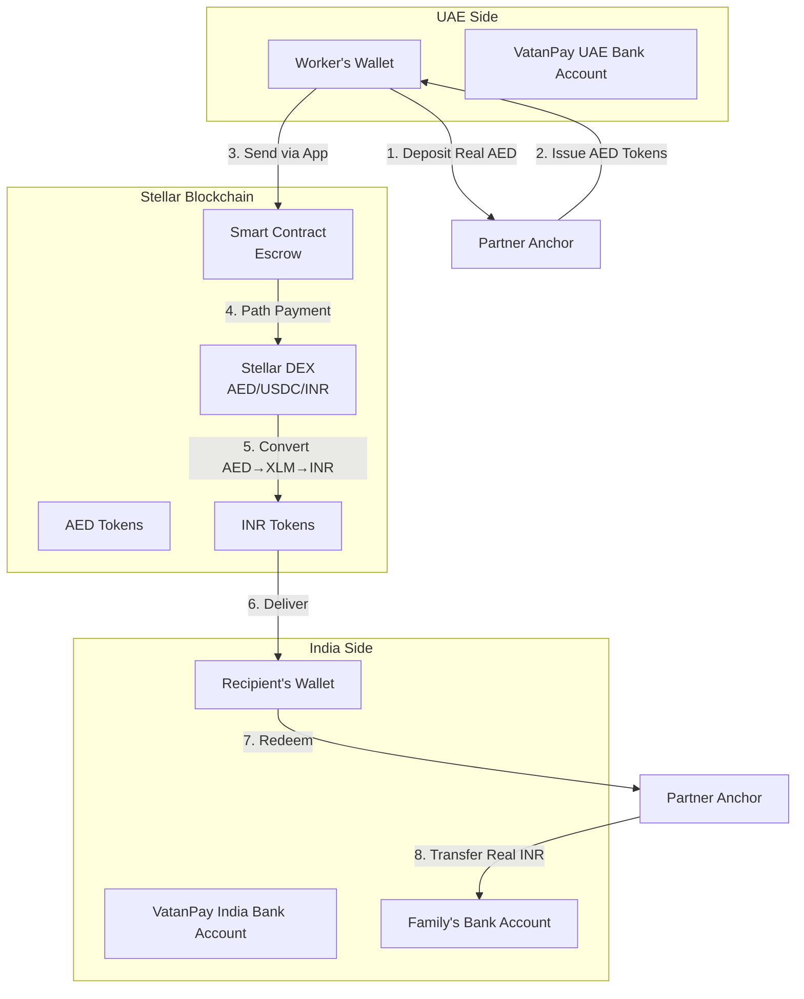
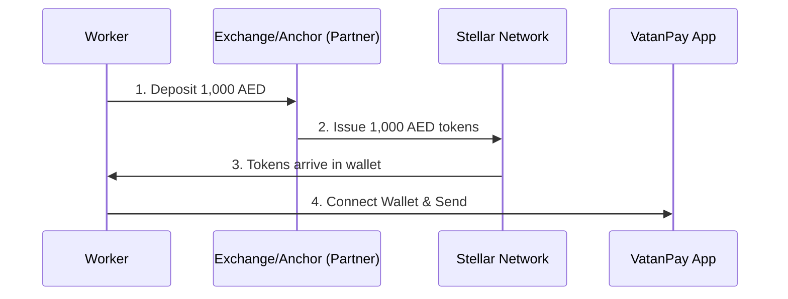
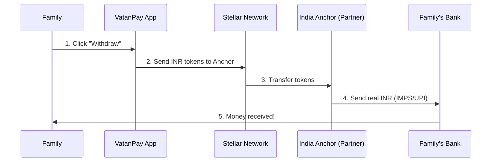

# How VatanPay Works - Complete Guide

## Table of Contents

- [Overview](#overview)
- [Architecture](#architecture)
- [Token Economics](#token-economics)
- [The Anchor System](#the-anchor-system)
- [Transaction Flow](#transaction-flow)
- [Current Demo vs Production](#current-demo-vs-production)
- [Technical Stack](#technical-stack)

---

## Overview

VatanPay is a blockchain-based remittance platform that enables Indian migrant workers in the Gulf to send money home **instantly** with **sub-1% fees** using the Stellar blockchain.

### The Problem

- Traditional remittance services (Western Union, banks) charge **5-7% fees**
- Transfers take **2-3 days** to complete
- Hidden exchange rate markups
- Limited operating hours

### The Solution

- **0.5% platform fee** (90% savings)
- **~5 second settlement** time
- Transparent real-time exchange rates
- 24/7 availability
- Powered by Stellar blockchain

---

## Architecture

### System Components



### Three-Layer Architecture

#### 1. Frontend Layer (React + Chakra UI)

- User interface for sending/receiving money
- Wallet connection (Freighter)
- Real-time exchange rate display
- Transaction history

#### 2. Blockchain Layer (Stellar + Soroban)

- **Smart Contract**: Escrow and transaction management
- **Stellar DEX**: Automatic currency conversion
- **Path Payments**: Multi-hop trading (AED→XLM→INR)
- **Network Fees**: ~$0.00001 per transaction

#### 3. Banking Layer (Not in Demo)

- Fiat on-ramp (Real AED → AED Tokens)
- Fiat off-ramp (INR Tokens → Real INR)
- KYC/AML compliance
- Reserve management

---

## Token Economics

### What Are Stellar Assets?

On Stellar, custom assets are **not cryptocurrencies** - they're **digital representations of real-world currencies** issued by trusted entities called **Anchors**.

### AED Token (UAE Dirham)

- **Issuer**: Regulated Partner Anchor (e.g., licensed exchange house)
- **Backing**: 1 AED token = 1 real AED in Anchor's bank account
- **Purpose**: Digital representation of Emirati Dirham on blockchain

### INR Token (Indian Rupee)

- **Issuer**: Regulated Partner Anchor (e.g., licensed fintech)
- **Backing**: 1 INR token = 1 real INR in Anchor's bank account
- **Purpose**: Digital representation of Indian Rupee on blockchain

### XLM (Stellar Lumens)

- **Purpose**: Pay network transaction fees ONLY
- **Amount needed**: Tiny (0.00001 XLM per transaction ≈ $0.000001)
- **NOT used for remittances**: Just for fees

### Trust Lines

Before using custom tokens, wallets must establish "trust lines":

```
User's Wallet → Trusts → AED Issuer
User's Wallet → Trusts → INR Issuer
```

---

## The Anchor System

### What is an Anchor?

An **Anchor** is a regulated financial institution (like a bank or licensed fintech) that:

1.  Holds real fiat currency in bank accounts
2.  Issues equivalent tokens on Stellar blockchain
3.  Redeems tokens for real fiat currency
4.  Handle KYC/AML compliance

**VatanPay's Role**: We are the **Interface Layer**. We don't issue tokens. We connect users to existing, licensed anchors.

### On-Ramp Process (Real Money → Tokens)



**Steps:**

1.  Worker deposits **real AED** to a partner Anchor (e.g., a local exchange house)
2.  Anchor verifies deposit and KYC
3.  Anchor issues **AED tokens** to worker's wallet
4.  Worker opens VatanPay to send money

**VatanPay serves as the "Venmo" interface**, while the Anchor acts as the "Bank".

### Off-Ramp Process (Tokens → Real Money)



**Steps:**

1.  Family receives INR tokens in VatanPay app
2.  Clicks "Withdraw to Bank"
3.  VatanPay routes tokens to a licensed **Indian Anchor**
4.  Anchor sends **real INR** to family's bank account via UPI/IMPS

**Why this works:**

- **Non-Custodial**: VatanPay never holds fiat currency
- **Regulatory Compliance**: Anchors handle KYC/AML
- **Scalability**: We focus on software, Anchors handle banking

---

## Transaction Flow

### Complete End-to-End Flow


### Detailed Step-by-Step

**Phase 1: Preparation (One-time)**

1. ✅ Worker installs Freighter wallet
2. ✅ Worker deposits real AED to **Partner Anchor**
3. ✅ Partner Anchor issues AED tokens to Worker's wallet
4. ✅ Recipient family creates Stellar wallet

**Phase 2: Sending Money (Every transaction)**

1. Worker opens VatanPay app at `https://vatanpay.app`
2. Connects Freighter wallet
3. Enters:
   - Amount in AED (e.g., 1,000 AED)
   - Recipient's Stellar address
4. Reviews transaction summary:
   - Exchange rate: `1 AED = 22.50 INR` (real-time from DEX)
   - Platform fee: `5 AED (0.5%)`
   - Network fee: `~0.00001 XLM`
   - **Recipient receives: ₹22,375 INR**
5. Clicks "Send Money" and approves in Freighter
6. **Transaction completes in ~5 seconds**

**Phase 3: Behind the Scenes (Automated)**

```
Step 1: Smart contract locks 1,000 AED in escrow
Step 2: Stellar executes path payment:
        - Sell 1,000 AED for XLM (DEX order book)
        - Sell XLM for ~22,500 INR (DEX order book)
Step 3: 22,375 INR tokens arrive in recipient's wallet
Step 4: Smart contract marks transaction "completed"
```

**Phase 4: Recipient Withdrawal**

1. Family opens VatanPay app
2. Sees "₹22,375 INR" balance
3. Clicks "Withdraw to Bank"
4. Enters Indian bank account/UPI ID
5. **Partner Anchor** sends real INR to bank within 5 minutes

---

## Current Demo vs Production

### What's Implemented (Demo/Testnet)

✅ **Smart Contract**

- Escrow functionality
- Transaction recording
- Fee calculation
- History tracking

✅ **Frontend**

- Wallet connection
- Send money interface
- Real-time exchange rates
- Transaction history

✅ **Blockchain Integration**

- Stellar testnet deployment
- DEX path payments
- Token transfers

### What's Missing (Production Requirements)

❌ **Banking Infrastructure**

- UAE bank account integration
- India bank account integration
- Automated deposit monitoring
- Automated withdrawal processing

❌ **Anchor Services**

- Token issuance system
- Token redemption system
- Reserve management
- 1:1 backing guarantee

❌ **Compliance**

- KYC/AML implementation
- Money Services Business (MSB) license
- Regulatory approvals (UAE Central Bank, RBI)
- Transaction monitoring

❌ **Production Operations**

- 24/7 customer support
- Fraud detection
- Dispute resolution
- Liquidity management

### Testing the Demo

**What you have:**

- Test AED and INR tokens (not real money)
- Freighter wallet with XLM for fees
- Working smart contract on Stellar testnet
- Functional frontend

**What you need to test:**

1. Fund your wallet with test AED tokens (via testnet scripts)
2. Use the app to send to another test wallet
3. Verify transaction on Stellar Expert (testnet)

**What you can't do:**

- Convert real AED to tokens (no banking)
- Withdraw real INR (no banking)
- Use on mainnet (contracts are testnet-only)

---

## Technical Stack

### Frontend

- **Framework**: React 18 + TypeScript + Vite
- **UI Library**: Chakra UI with custom theme
- **Wallet**: Freighter API (@stellar/freighter-api)
- **Blockchain**: stellar-sdk v13+
- **Routing**: React Router v7

### Smart Contract

- **Language**: Rust
- **Framework**: Soroban SDK
- **Network**: Stellar Testnet
- **Functions**:
  - `create_remittance()` - Create escrow
  - `complete_remittance()` - Finalize transfer
  - `calculate_fee()` - Compute fees
  - `get_user_history()` - Query transactions

### Blockchain

- **Network**: Stellar
- **DEX**: Built-in Stellar DEX (order books)
- **Path Payments**: Multi-currency atomic swaps
- **Assets**: Custom tokens (AED, INR)
- **Fees**: 100 stroops = 0.00001 XLM ≈ $0.000001

### Key Advantages of Stellar

1. **Built-in DEX**: No external AMM needed
2. **Path Payments**: Automatic multi-hop trading
3. **Low Fees**: $0.000001 per transaction
4. **Fast**: 3-5 second finality
5. **Anchors**: Established system for fiat integration

---

## Production Checklist

To launch VatanPay in production:

### Legal & Compliance

- [ ] Register as MSB in UAE
- [ ] Register as Payment Gateway in India
- [ ] Obtain Central Bank approvals
- [ ] Implement KYC/AML procedures
- [ ] Set up compliance monitoring

### Banking & Finance

- [ ] Open business bank account in UAE
- [ ] Open business bank account in India
- [ ] Establish SWIFT/bank transfer integration
- [ ] Set up UPI/NEFT/IMPS integration
- [ ] Maintain operational reserves
- [ ] Arrange audit procedures

### Technology

- [ ] Deploy to Stellar mainnet
- [ ] Build deposit monitoring system
- [ ] Build withdrawal processing system
- [ ] Implement automated reconciliation
- [ ] Set up backup/disaster recovery
- [ ] Add fraud detection AI

### Operations

- [ ] Hire compliance officer
- [ ] Set up customer support (24/7)
- [ ] Create dispute resolution process
- [ ] Establish liquidity management
- [ ] Build monitoring dashboard

### Marketing & Growth

- [ ] Obtain necessary licenses to operate
- [ ] Partner with UAE exchange houses
- [ ] Onboard initial users
- [ ] Market to Indian diaspora communities

---

## FAQ

### How is this different from Western Union?

- **Cost**: 0.5% vs 5-7% (10x cheaper)
- **Speed**: 5 seconds vs 2-3 days (1000x faster)
- **Transparency**: Real-time rates vs hidden markups
- **Availability**: 24/7 vs business hours only

### Is my money safe?

Yes, multiple layers of security:

- Smart contracts are audited and immutable
- Stellar blockchain is proven (billions in daily volume)
- Anchor reserves are 1:1 backed and audited
- Non-custodial: You control your keys

### What if exchange rate changes during transfer?

- Rate locks when you click "Send"
- 2% slippage protection built-in
- If DEX can't fulfill at that rate, transaction fails and funds return

### Can I cancel a transaction?

- Once confirmed on blockchain: No (irreversible)
- Before clicking "Send": Yes
- Failed transactions refund automatically

### Do I need crypto knowledge?

No! The app abstracts all blockchain complexity:

- You think in AED and INR (not tokens)
- You never see XLM or crypto
- It works like a normal money transfer app

---

## Real-World Examples

### Similar Projects

**Circle (USDC)**

- Issues USDC stablecoin 1:1 backed by USD
- Billions in daily volume
- Licensed and regulated
- VatanPay uses similar model for AED/INR

**MoneyGram + Stellar**

- Partnership since 2021
- Uses Stellar for settlement
- Converts USD → USDC → Local currency
- Proof that model works at scale

**SatoshiPay**

- Uses Stellar anchors for African remittances
- Processes real transactions
- Shows viability in emerging markets

---

## Glossary

**Anchor**: Trusted entity that issues tokens backed by real currency

**Asset**: Custom token on Stellar (AED, INR, USDC, etc.)

**DEX**: Decentralized Exchange (built into Stellar)

**Escrow**: Smart contract holds funds until conditions met

**Path Payment**: Automatic multi-currency swap (AED→XLM→INR)

**Slippage**: Difference between expected and actual exchange rate

**Stroop**: Smallest unit of XLM (0.0000001 XLM)

**Trust Line**: Permission to receive a specific asset

**XDR**: Transaction format used by Stellar

**XLM**: Stellar's native cryptocurrency (used for fees)

---

## Resources

- **Stellar Docs**: https://developers.stellar.org/
- **Soroban Docs**: https://soroban.stellar.org/
- **Freighter Wallet**: https://www.freighter.app/
- **Stellar Explorer**: https://stellar.expert/
- **VatanPay GitHub**: https://github.com/your-repo

---

**Last Updated**: January 30, 2026  
**Version**: 1.0 (Testnet Demo)
